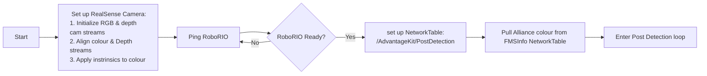

# Introduction
Code resides on the Raspberry Pi with a specific installation (Raspberry Pi OS with virtual environment allowing modified Python binary).  
On the Pi, this code is named "post-detect.py" (previously named "post-HSV-Depth-nt.py")  
This will connect with the Roborio and publish a table 'PostDetection' that includes:
     if a post is detected (boolean) 
     the horizontal left/right (lateral) position in metres
     the depth (horizontal distance normal front of camera front) in metres

# Starting up
Prior to entering the main loop, the Pi starts itself up and waits for the RoboRIO:

# Script Step-by-step: Post Detection 
Connects with RealSense camera and:  
   1. Images from RGB (colour) and LIDAR (depth) cameras are aligned prior to entering loop.   Clipping distance was also set.
   2. Although alliance colour (redalliance is set to True or False) was set before entering, it is checked within the loop to avoid timing issues with FMSInfo updates. There is a chance that the RoboRIO and RealSense Pi initialize before alliance has been updated in FMSInfo.
   3. Depth-camera image used: all pixels where distance greater-than clipping distance are set to black. Image is then cleaned using OpenCV morphologyEx: MORPH_CLOSE using Rectangular element.

| The raw image from the RGB camera   | raw mask from the depth camera | Lightly cleaned depth mask |
| :--- | :--- | :--- |
|  |  |  |

   4. depth mask is applied to colour image:   

   5. HSV colour mask is then applied: all pixels out of colour range (red or blue) are set to black

| pixels within HSV range are set to light grey | colour-mask applied to depth-masked colour image from step 2* |
| :--- | :--- |
|  |  |
|   |  *Note: just for illustration, this isn't used by the program |  

   6. OpenCV "contours" used to choose most post-like piece of image:
         - small contours are ignored as noise (<5 wide or <20 high)
         - only contours with minimum aspect ratio (height/width) greater than set value are considered
         - Note: minimum aspect-ratio was originally 2.0, but reduced to 1.6 after testing
         - contours are scored based on area (the largest area is selected)
         - future improvement: include average depth of each contour to include in contour score
         - centre of this contour is considered returned as the x-value in pixels
         - intrinsics are used to convert the x-value to metres
         - as camera gets closer to post, precision should increase as edge noise has less weight  
         - horizontal/lateral position of the post centre:  

   6. Results are published to NetworkTable 'PostDetection'
      | Name | Data Type | Description |
      | :--- | :--- | :--- |
      | 'post_detected' | Boolean | True if post detected |
      | 'post_lateral' | Number | horizontal displacement perpendicular to depth-direction, in metres |
      | 'post_depth' | Number | distance from camera (normal to camera-face) in metres |

# The Plan
At the time of writing, the plan is to use this camera and code for final alignment during climbing stage. Odometry and possibly turret-targeting cameras will be used to get "close" to the post (30 to 50cm away). Once the "Post Detection" NetworkTable boolen "post_detected" is TRUE, the RoboRIO climbing code will switch to using the "Post Detection" NetworkTable data, "post_lateral" and "post_depth" to accurately position so it can attach and climb.

